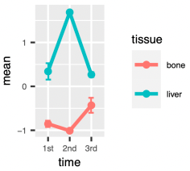
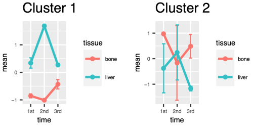

Identifies clusters in a DESeq2 object using the `degPatterns` function from [DEGreport](https://github.com/lpantano/DEGreport).

# Context 
This tool clusters elements that show a similar pattern or behavior accross group of samples using the [`degPatterns`](https://rdrr.io/github/lpantano/DEGreport/man/degPatterns.html) function. Two different approaches to cluster elements are supported: [`diana`](https://www.rdocumentation.org/packages/cluster/versions/2.1.2/topics/diana) and [`ConsensusClusterPlus`](https://bioconductor.org/packages/release/bioc/html/ConsensusClusterPlus.html). 

The most common use case for `degPatterns` is to cluster genes in an [RNA-Seq](https://en.wikipedia.org/wiki/RNA-Seq) differential expression analysis; however, it can also be used in [ChIP-seq](https://en.wikipedia.org/wiki/ChIP_sequencing) for [differential peak binding](https://github.com/crazyhottommy/ChIP-seq-analysis/blob/master/part3_Differential_binding_by_DESeq2.md) as well as in [Metagenomics](https://www.genome.gov/genetics-glossary/Metagenomics), for [differential abundance](https://joey711.github.io/phyloseq-extensions/DESeq2.html) studies.
 
# Inputs
## Required inputs
This tool has the following **required** inputs:

1. **`deseq2Object`** 

	DESeq2 object in [RDS](https://www.r-bloggers.com/2016/12/remember-to-use-the-rds-format/) format. This object is generated after running the [`DESeq`](https://www.rdocumentation.org/packages/DESeq2/versions/1.12.3/topics/DESeq) function from DESeq2.   

2. **`explanatoryVar`** 

	Explanatory variable in the DESeq2 object. In an experimental study, it is the variable that is manipulated by the researcher (e.g. `time`). It will be used on the x-axis of the plots. This variable must exist in the DESeq2 object. 
   
	If the `designFile` shown below was used to run a differential expression analysis with DESeq2. The variable `time` could then be used as `explanatoryVar` when running `degPatterns`.

```console
sample	tissue	sex	time
sample_1	bone	M	1st
sample_2	bone	F	2nd
sample_3	bone	M	3rd
sample_4	bone	M	1st
sample_5	bone	F	2nd
sample_6	bone	M	3rd
sample_7	liver	F	1st
sample_8	liver	M	2nd
sample_9	liver	F	3rd
sample_10	liver	F	1st
sample_11	liver	M	2nd
sample_12	liver	F	3rd
```

## Optional inputs
The tool provides additional configuration through the following **optional** inputs:

1. **`qValue`**

	[Q-value](https://www.statisticshowto.com/q-value/) threshold to filter elements from the DESeq2 object (default: `0.05`).

2. **`log2FoldChange`**

	Minimum absolute log2 fold-change threshold to filter elements from the DESeq2 object (default: `0`).

3. **`minElements`**

	Minimum number of elements to form a cluster (default: `15`).

4. **`groupVar`**   

	Group variable in the DESeq2 object. It will determine how samples are grouped (eg. male/female, control/mutant). This variable must exist in the DESeq2 object. 

	If the `designFile` shown below was used to run a differential expression analysis with DESeq2. The variables `tissue` or `sex` could then be used as `groupVar` when running `degPatterns`.

```console
sample	tissue	sex	time
sample_1	bone	M	1st
sample_2	bone	F	2nd
sample_3	bone	M	3rd
sample_4	bone	M	1st
sample_5	bone	F	2nd
sample_6	bone	M	3rd
sample_7	liver	F	1st
sample_8	liver	M	2nd
sample_9	liver	F	3rd
sample_10	liver	F	1st
sample_11	liver	M	2nd
sample_12	liver	F	3rd
```

5. **`clusterMethod`**

	Clustering method to use, either [`diana`](https://www.rdocumentation.org/packages/cluster/versions/2.1.2/topics/diana) or [`ConsensusClusterPlus`](https://bioconductor.org/packages/release/bioc/html/ConsensusClusterPlus.html) funtion (default: `diana`).

6. **`removeOutliers`**

	Remove outliers from the cluster distribution (default: `true`).

7. **`scale`**

	Scale DESeq2 normalized count matrix (default: `true`).

8. **`plotsPerColumn`**

	Number of plots per column in the `summaryPlot` output file. Maximum number of plots allowed per column are `5` (default: `2`).

9. **`plotsPerRow`**
	
	Number of plots per row in the `summaryPlot` output file. Maximum number of plots allowed per row are `5` (default: `2`).
10. **`outputPrefix`**

	Prefix name for the output file (default: `deg-patterns`).

# Outputs
## Required outputs
This tool will **always** provide the following outputs:

1. **`degReport`**

	Tab delimited table describing the association between each element and the assigned cluster. 

| Column name         |	Definition                                                                                                                         |
|:------------------- |:---------------------------------------------------------------------------------------------------------------------------------- |
| [*element_ID*]        | Unique identifier for each element. Eg., geneID and	sampleID.                                                                      |
| merge               | Interaction specified in the designFormula while running DESeq2.                                                                   |
| value               | Z-score using the mean and the standard deviation from elements at the same merge level. This is the value displayed on the y-axis of the plots. |
| [*metadata_columns*]  | Columns representing the metadata associated with the particular element. Eg. for a gene it can be tissue, time, and sex.          |
| sizeFactor          | Geometric mean considering elements with the same `merge` value (ie., the `sizeFactor` will be the same for all elements at the same `explanatoryVar` and `groupVar` level). |
| cluster             | Cluster assigned to the particular element.                                                                                         |

2. **`elementClusterMap`**

	Tab delimited table describing what cluster has been assigned to each element. Two columns namely, `id`, which represents the element identification number and `cluster`, which representing the assigned cluster are present.

3. **`clusterCount`**

	Tab delimited table summarizing the number of elements per cluster. Two columns namely, `cluster`, which represents the particular cluster ID and `count`, which represents the number of times that cluster is repeated are present.

4. **`summaryPlot`**

	PDF file displaying plots of all the identified clusters. The x-axis represents the factors from the `explanatoryVar` input, while the y-axis represents the [Z-score](https://www.investopedia.com/terms/z/zscore.asp) ranges. Z-score represents the value's relationship with the mean and is measured in terms of standard deviation from the mean. For example, a zero value indicates that it is equal to the mean, while a value of positive or negative one indicates that it's one standard deviation above or below the mean respectively. An example of the plot is shown below:

   

5. **`clusterPlots`**

	Compressed `.tar.gz` file with individual [Plotly](https://plotly.com/r/) cluster plots.    

# Example
## Get input data
This tool expects a DESeq2 object in RDS format. This can be generated by running the [matrix-to-deseq2](https://platform.batchx.io/batchx/tools/bioinformatics%2Fdeseq2%2Fmatrix-to-deseq2) tool found in the BatchX marketplace. The RDS object generated from [Example 4](https://platform.batchx.io/batchx/tools/bioinformatics%2Fdeseq2%2Fmatrix-to-deseq2/documentation#example-4) will be used here as input (i.e., `time_series.deseq2.RDS`).  

## Upload input data into BatchX
In case the RDS object is not on BatchX use the following command to upload this file to the BatchX file system:

```console
bx cp time_series.deseq2.RDS bx://test/degreports/
```

## Submit job
Submit a job to cluster genes expressing similarly across `time` and belonging to two different `tissue`.

```console
bx submit lpantano-team@degreport/deg-patterns:0.0.4 '{
    "deseq2Object": "bx://test/degreports/time_series.deseq2.RDS",
    "explanatoryVar": "time",
    "qValue": 0.5,
    "log2FoldChange": 0.1,
    "plotsPerColumn": 4,
    "plotsPerRow": 4,
    "removeOutliers": false,
    "groupVar": "tissue",
    "outputPrefix": "time-tissue",
    "minElements": 1
}'
```

The above job will create two clusters which upon visualization looks like the following:



# Links
- [DEGreport vignette](https://bioconductor.org/packages/release/bioc/vignettes/DEGreport/inst/doc/DEGreport.html#report-from-deseq2-analysis)
- [degPattern documentation](https://lpantano.github.io/DEGreport/reference/degPlotCluster.html)
- [degPatterns tutorial](https://hbctraining.github.io/DGE_workshop/lessons/08_DGE_LRT.html)
- [DESeq2 vignette](http://bioconductor.org/packages/devel/bioc/vignettes/DESeq2/inst/doc/DESeq2.html)

# Tool versions

* **DESeq2:** 1.36.0

* **DEGreport:** 1.32.0

* **dplyr:** 1.0.9
